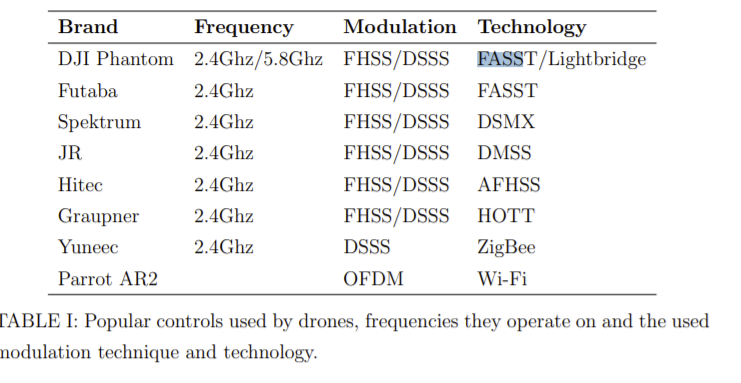
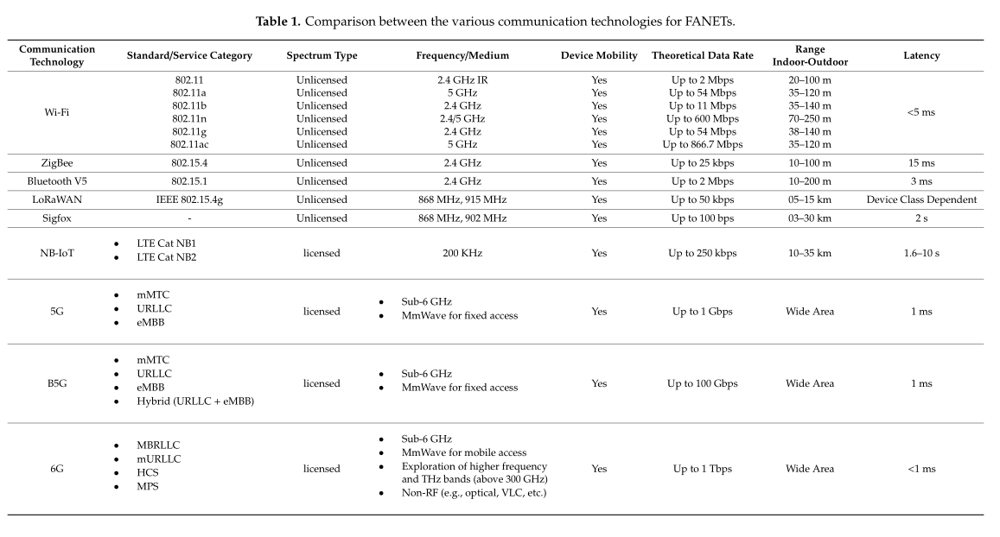

# Monday, March 7, 2022

## Some data on different comm protocols
FASST Lightbridge, or newer Occusync, are high end drone comm protocols. Lightbridge and Occusync are from the company DJI, and some FFCID docs show that their TX power is in the range of 130 and 200 mWs, in the bands of 2.4GHz and 5GHz. https://fccid.io/SS3-L1P1805

The newer Mavic 3 has ~1W on its antenna, but still below FCC requirements. Wondering whether they get an exception for being a drone. (You know, far from people etc.)
https://fccid.io/SS3-L2P2104/RF-Exposure-Info/MPE-Report-5493476

802.11 Cheatsheet https://packetlife.net/media/library/4/IEEE_802.11_WLAN.pdf

### Batman?

https://www.open-mesh.org/projects/batman-adv/wiki/Wiki

## Links
https://ieeexplore.ieee.org/document/9044328

## Modules
The modules that are in use are:
 
