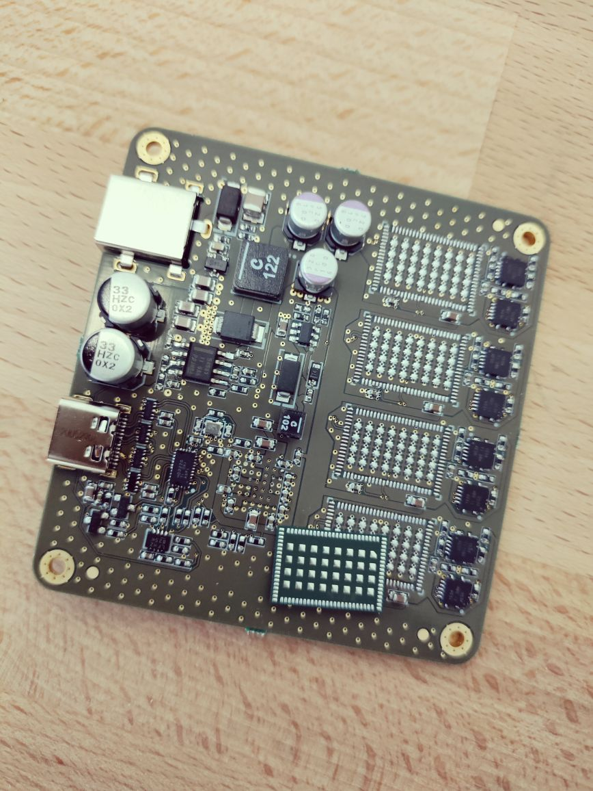
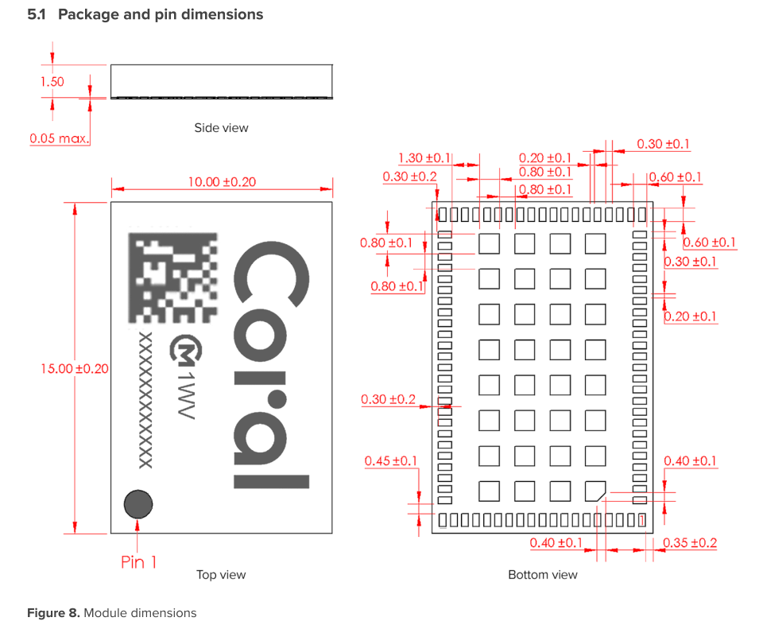

# lessons-learned-1

## Driving Event
The board for [[coral-reef]] was manually assembled on the 19th. We realized that the Google Coral chips were marked in a way that the component was impossible to be positioned in the way that it was designed to be. It was quickly realized that the footprint was defined as "flipped". That is, as being looked from the bottom side of the module.

## Reasons

The datasheet for the Coral module has a mechanical drawing as seen. 

Clearly, it was stated that the pads are drawn as they are being seen from the bottom side of the module. This was missed in the footprint definition phase, and the footprint was defined wrongly. 

## Results

This resulted in a redesign, with material costs of ~€150, two extra weeks for PCB prototyping. 

## Mitigation

- Experience counts. 
- Where possible, design elements that are open to sharing should be used. (SnapEDA, Celestial etc.)
- There can be a [[footprint-definition-checklist]] made.
- There can be a [[PCB-layout-checklist]] made.
- 3D modeling of components could have aided the eye. 

[//begin]: # "Autogenerated link references for markdown compatibility"
[coral-reef]: coral-reef.md "Coral Reef"
[//end]: # "Autogenerated link references"